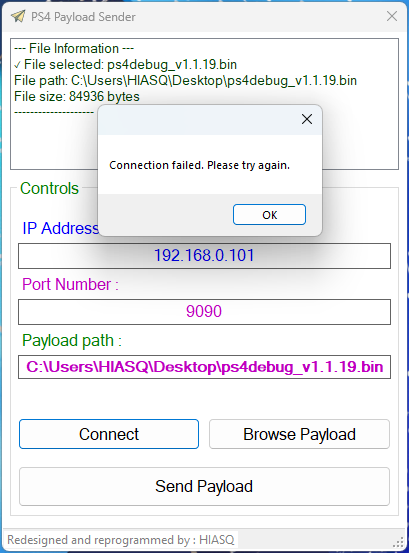

# PS4 Payload Sender

A modernized and fully re-engineered version of the open-source **PS4 Payload Sender**, originally developed by **valentinbreiz**.  
This application has been rebuilt from scratch to offer better stability, a cleaner UI, and more maintainable code.

---

## 📦 Installation

There are two ways to install and run the application:

1. **Executable File (`.exe`)**  
   Simply run the provided `.exe` file — no installation required.

2. **Installer**  
   Use the included setup installer to install the application on your system like any standard Windows program.

> 🔧 Make sure you have [.NET Framework 4.6.1](https://dotnet.microsoft.com/en-us/download/dotnet-framework/net461) installed.

---

## ⚙️ How to Use

1. **Connect your PS4**  
   - Open the *GoldHen* server settings on your PS4.
   - FTP, --Bin Loader*
   - Ensure that the payload port (typically `9090` or `9020`) is open and ready.

2. **Enter PS4 IP Address**  
   - On your PS4, check your network settings and find your local IP address.
   - Enter that IP into the application to establish the connection.

3. **Send Payloads**  
   - Once connected, choose and send your desired payloads easily via the app.

---

## ✅ Tested On

- **Windows 11**
- **PlayStation 4 Firmware 12.02**
- **GoldHen OR BIN Loader**

---

## 🛠 Key Improvements

- Real-time log and feedback with auto-scrolling.
- Enhanced UI/UX with dynamic control states.
- More helpful error and success messages.
- Improved exception handling with detailed messages.
- Clean and modern code with better naming and structure.
- Graceful socket disconnection logic.

---

## 🙏 Acknowledgment

This project is a fork of the original open-source work by **valentinbreiz**.  
Original source code available here:  
👉 [valentinbreiz's PS4 Payload Sender](https://github.com/valentinbreiz/PS4-Payload-Sender/blob/master/PS4%20Payload%20Sender/Form1.cs)

---

## ❗ Disclaimer

This software is provided **for educational and personal use only**.  
The developers are not responsible for any misuse of the application.
Use this tool at your own risk.

## ❗ BY: HIASQ
---

